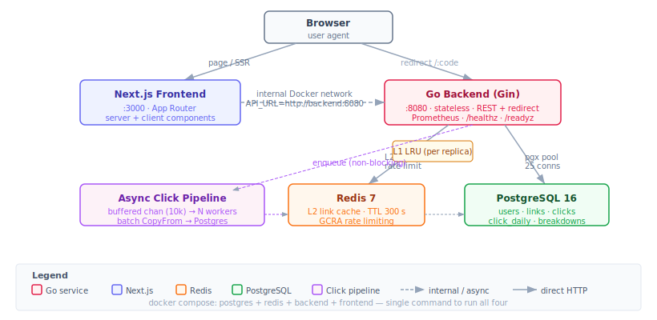
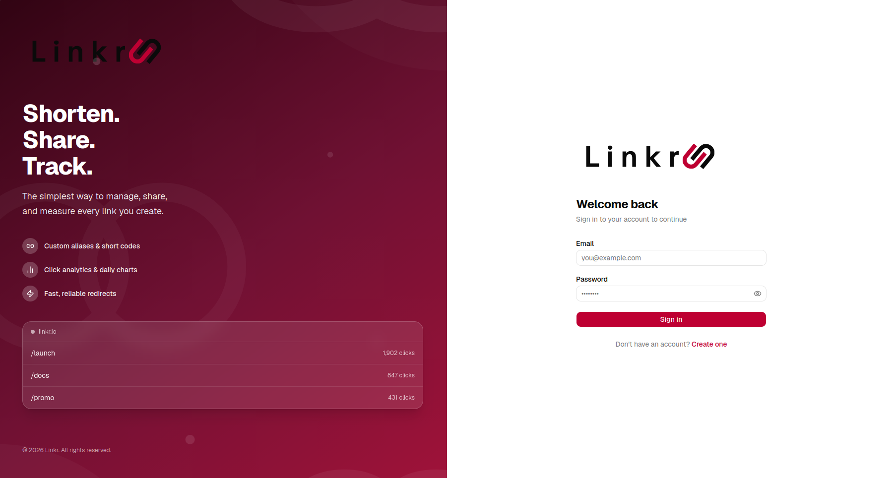
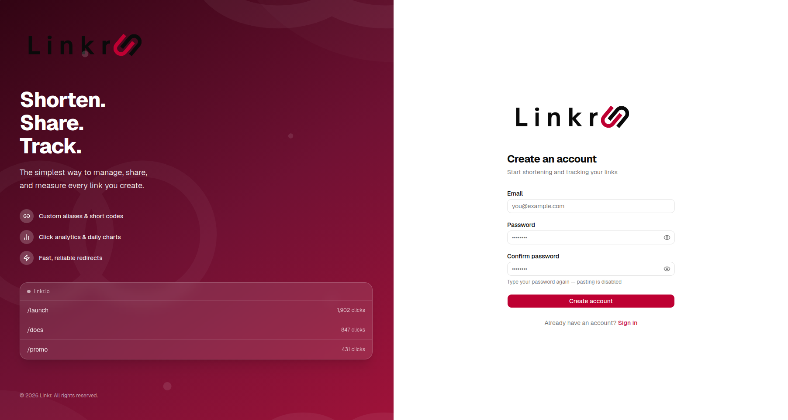
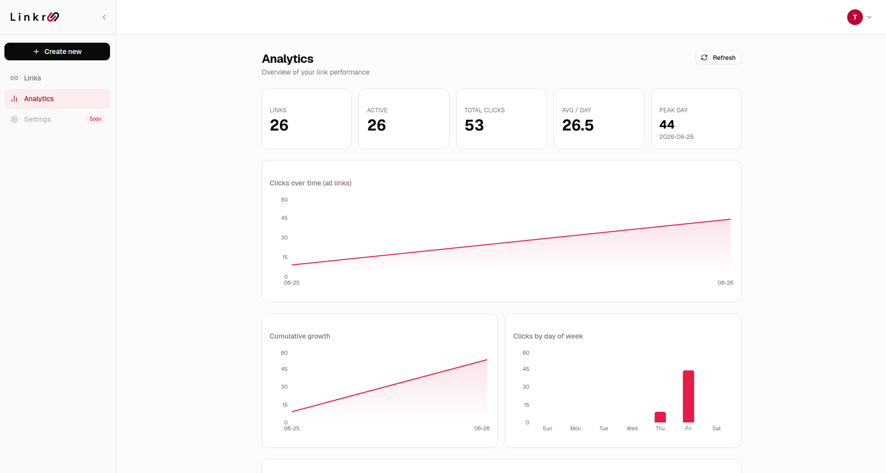
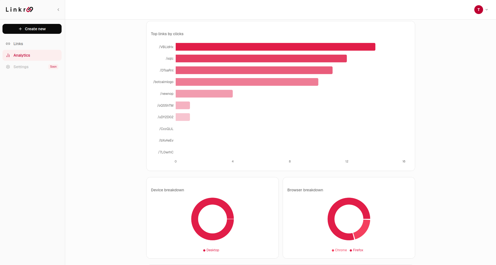
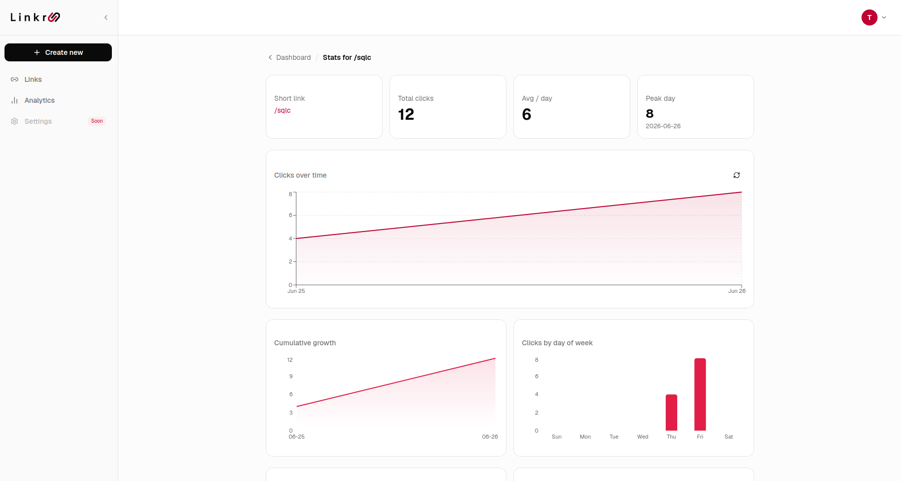
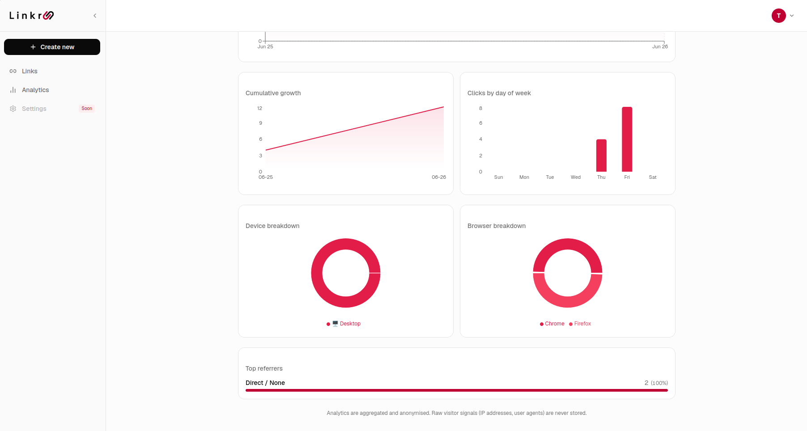

# Linkr — URL Shortener with Analytics

A production-grade URL shortener built with **Go (Gin)** and **Next.js**. Create short links, track clicks, and view per-link analytics broken down by day, device, browser, and referrer.



| Service | Stack | Port |
|---|---|---|
| Frontend | Next.js · App Router · TanStack Query | 3000 |
| Backend | Go · Gin · pgx · Redis | 8080 |
| Cache | Redis 7 (L2 cache + rate limit) | 6379 |
| Database | PostgreSQL 16 | 5432 |

→ **[Backend architecture & scaling](backend/README.md)** · **[Frontend architecture](frontend/README.md)** · **[Design decisions](DECISIONS.md)**

---

## Screenshots

**Auth**

| Login | Register |
|---|---|
|  |  |

**Analytics — aggregate overview**

| Stats cards · clicks over time · cumulative growth · day of week | Top links by clicks · device & browser breakdown |
|---|---|
|  |  |

**Analytics — per-link stats**

| Clicks over time | Cumulative growth · device & browser donuts · referrers |
|---|---|
|  |  |

---

## Prerequisites

| Tool | Version |
|---|---|
| Docker + Compose | any recent |
| Go | 1.22+ *(local dev only)* |
| Node.js | 20+ *(local dev only)* |
| [Task](https://taskfile.dev) | any *(optional)* |

---

## Quick Start — Docker (recommended)

Runs all four services (Postgres, Redis, Go backend, Next.js frontend) with one command.

```bash
# 1. Create your env file
cp .env.example .env
#    Set JWT_SECRET to a random string of 32+ characters

# 2. Build images and start everything
docker compose up --build
```

- Dashboard: `http://localhost:3000`
- API + Swagger: `http://localhost:8080/swagger/index.html`
- Prometheus metrics: `http://localhost:8080/metrics`

Stop: `docker compose down`
Wipe DB volume too: `docker compose down -v`

---

## Quick Start — Local Dev

### 1. Start Postgres + Redis

```bash
docker compose up -d postgres redis
```

### 2. Configure and run the backend

```bash
cp backend/.env.example backend/.env
# Edit backend/.env — set JWT_SECRET (32+ chars)

task run          # or: cd backend && go run ./cmd/api/
```

API at `http://localhost:8080`. Migrations run automatically on startup.

### 3. Configure and run the frontend

```bash
cp frontend/.env.example frontend/.env.local

task web          # or: cd frontend && npm install && npm run dev
```

Dashboard at `http://localhost:3000`.

---

## Running Tests

```bash
task test                      # race detector included
# or:
cd backend && go test -race ./...
```

Tests cover: short-code generation, URL validation, JWT auth, async click pipeline (batch flush, ticker flush, drop on full buffer, drain on shutdown, concurrent enqueue under `-race`), link domain logic, user-agent parsing.

---

## Project Structure

```
.
├── backend/               Go API server
│   ├── cmd/api/           Entry point (main.go, graceful shutdown)
│   ├── internal/
│   │   ├── clicks/        Async click pipeline (buffered channel → batch CopyFrom)
│   │   ├── config/        Typed env config with defaults
│   │   ├── domain/        Core types (Link, ClickEvent, Stats)
│   │   ├── http/          Gin router, handlers, middleware
│   │   ├── repository/    PostgreSQL queries (pgx)
│   │   ├── service/       Tiered cache (LRU + Redis + circuit breaker)
│   │   ├── shortcode/     Secure random base62 code generation
│   │   └── usecase/       Business logic
│   └── migrations/        SQL migrations (golang-migrate, 4 total)
├── frontend/              Next.js app
│   ├── app/               App Router pages + Route Handler proxies
│   └── components/        Server and client components
├── docs/                  Architecture SVG diagrams
├── docker-compose.yml     Full-stack: Postgres + Redis + backend + frontend
├── Taskfile.yml           Task runner shortcuts
└── DECISIONS.md           Architecture decisions and trade-offs
```

---

## API Overview

| Method | Path | Auth | Description |
|---|---|---|---|
| `POST` | `/api/auth/register` | — | Create account |
| `POST` | `/api/auth/login` | — | Get JWT |
| `GET` | `/api/auth/me` | JWT | Current user |
| `POST` | `/api/links` | JWT | Create short link |
| `GET` | `/api/links` | JWT | List links (cursor pagination) |
| `PATCH` | `/api/links/:id` | JWT | Toggle active / set expiry |
| `DELETE` | `/api/links/:id` | JWT | Soft-delete link |
| `GET` | `/api/links/:code/stats` | JWT | Click analytics |
| `GET` | `/api/analytics/overview` | JWT | Aggregate stats across all links |
| `GET` | `/:code` | — | Redirect (hot path) |
| `GET` | `/metrics` | — | Prometheus metrics |
| `GET` | `/healthz` | — | Liveness probe |
| `GET` | `/readyz` | — | Readiness probe (pings DB) |

Full interactive docs: `http://localhost:8080/swagger/index.html`

---

## Environment Variables

### Backend (`backend/.env`)

| Variable | Default | Description |
|---|---|---|
| `DATABASE_URL` | *(required)* | PostgreSQL connection string |
| `JWT_SECRET` | *(required, 32+ chars)* | HMAC secret for JWT signing |
| `PORT` | `8080` | HTTP listen port |
| `REDIS_URL` | *(empty — disables Redis)* | Redis connection URL |
| `CACHE_SIZE` | `10000` | L1 LRU max entries |
| `L1_CACHE_TTL_SEC` | `30` | L1 TTL in seconds |
| `REDIS_CACHE_TTL_SEC` | `300` | Redis TTL in seconds |
| `CLICK_BUFFER_SIZE` | `10000` | Click pipeline channel capacity |
| `CLICK_BATCH_SIZE` | `500` | Events flushed per DB write |
| `CLICK_FLUSH_INTERVAL_MS` | `200` | Max ms between flushes |
| `CLICK_WORKERS` | `4` | Concurrent flush workers |
| `DB_MAX_CONNS` | `25` | pgxpool max connections |
| `DB_MIN_CONNS` | `5` | pgxpool min connections |
| `RATE_LIMIT_RPS` | `100` | Per-IP requests per second |
| `RATE_LIMIT_BURST` | `200` | Per-IP burst allowance |
| `CACHE_CONTROL_MAX_AGE_SEC` | `60` | `Cache-Control` max-age on redirects |

### Frontend (`frontend/.env.local`)

| Variable | Default | Description |
|---|---|---|
| `NEXT_PUBLIC_API_URL` | `http://localhost:8080` | Backend URL (client-side, baked into bundle) |
| `API_URL` | `http://localhost:8080` | Backend URL (server-side Route Handlers) |
| `JWT_COOKIE_NAME` | `linkr_token` | HTTP-only JWT cookie name |
