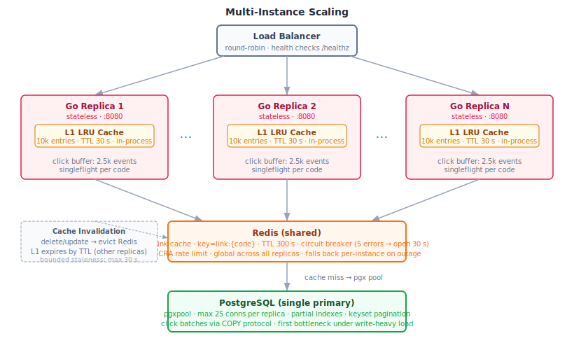
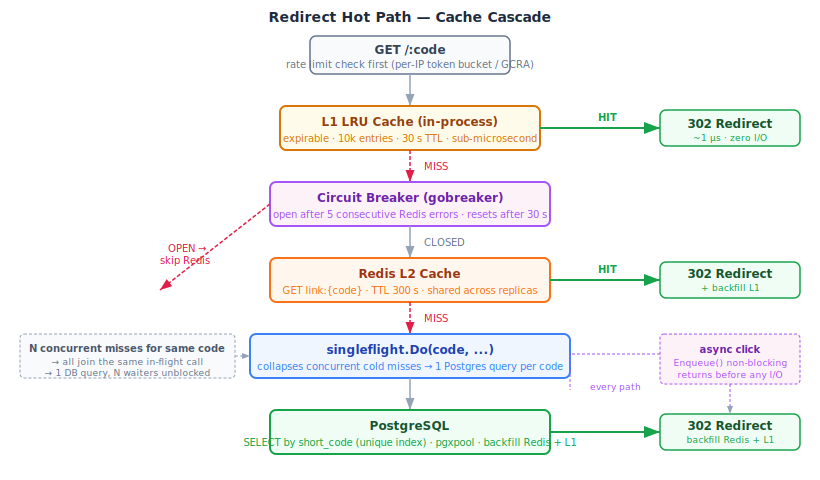
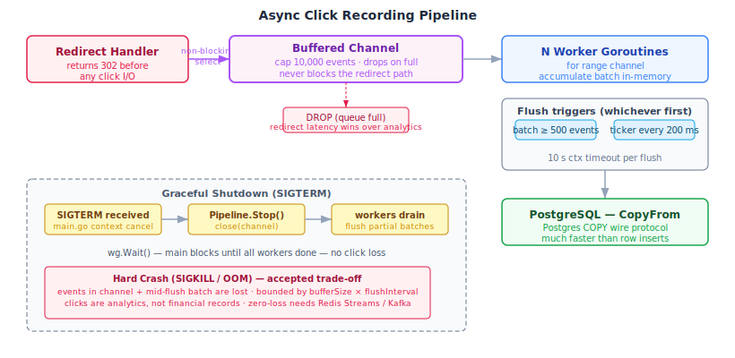
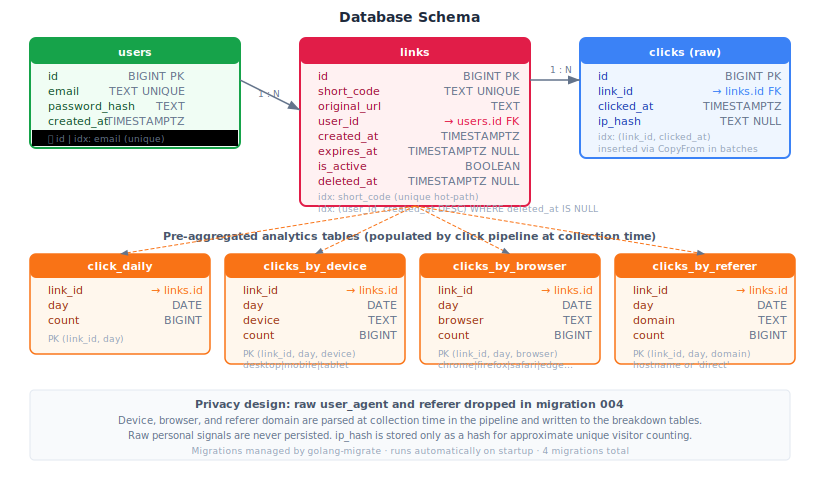

# Linkr — Backend

Go (Gin) API server: REST endpoints, redirect hot path, async click pipeline, tiered cache, and Prometheus metrics.
See the [root README](../README.md) for full-stack setup and env vars. See [DECISIONS.md](../DECISIONS.md) for trade-offs.

---

## Architecture

### Multi-Instance Scaling



Every replica is **fully stateless** — no sticky sessions, no shared in-process state between instances.
The load balancer distributes freely; adding a replica scales linearly.

| Layer | What it does | Degrades gracefully to |
|---|---|---|
| L1 LRU (per replica) | In-process, sub-µs lookups, 30 s TTL | Redis or Postgres |
| Redis L2 cache | Shared across all replicas, 300 s TTL | Postgres (circuit breaker opens) |
| PostgreSQL | Single primary, connection pool | First genuine write bottleneck |
| Rate limit (Redis) | GCRA global limit per IP | Per-instance token bucket on Redis outage |

The **circuit breaker** (`gobreaker`) opens after 5 consecutive Redis errors and closes after 30 s.
While open, all requests skip Redis entirely — no 500 ms timeout stalls, no goroutine pile-up.

---

### Redirect Hot Path



A redirect request resolves in three possible ways, fastest first:

1. **L1 LRU hit** — in-process memory, ~1 µs, zero network I/O
2. **Redis hit** — distributed cache, ~1 ms, backfills L1
3. **Postgres query** — guarded by `singleflight`: N concurrent cold misses for the same code collapse into one DB round trip

Every path records a click via a **non-blocking enqueue** — the redirect returns before any click I/O starts.
`Cache-Control: public, max-age=60` is set on the response so a CDN or browser caches the redirect entirely.

---

### Async Click Pipeline



```
redirect handler
    │  non-blocking select
    ▼
buffered channel  (cap: 10,000 events)
    │  drops on full — redirect latency is never sacrificed
    ▼
N worker goroutines  (default: 4)
    │  flush on: batch ≥ 500  OR  ticker every 200 ms
    ▼
PostgreSQL  — pgx CopyFrom (COPY wire protocol)
```

**Graceful shutdown (`SIGTERM`):** `Pipeline.Stop()` closes the channel; workers drain their partial batches via `WaitGroup` before the process exits. No events are lost.

**Hard crash (SIGKILL):** Events in the channel and any mid-flush batch are lost. Bounded by `bufferSize × flushInterval` — typically a few seconds of traffic. Click counts are analytics data, not financial records.

---

### Database Schema



**Key indexes:**

| Index | Purpose |
|---|---|
| `links(short_code)` UNIQUE | Hot-path redirect lookup |
| `links(user_id, created_at DESC)` WHERE `deleted_at IS NULL` | Dashboard list (keyset pagination) |
| `clicks(link_id, clicked_at)` | Per-link time-series stats |
| `clicks_by_*` composite PKs | Pre-aggregated device/browser/referer breakdowns |

Analytics breakdown columns (device, browser, referer domain) are parsed at collection time and stored as counts. Raw `user_agent` and `referer` strings are not persisted.

---

## Running

```bash
# from repo root
task run

# or from this directory
go run ./cmd/api/
```

Requires `DATABASE_URL` and `JWT_SECRET` (32+ chars) set in `.env`. Copy `.env.example` to get started.
Migrations run automatically on startup.

API: `http://localhost:8080`
Swagger UI: `http://localhost:8080/swagger/index.html`
Prometheus metrics: `http://localhost:8080/metrics`
Health: `http://localhost:8080/healthz` · Readiness: `http://localhost:8080/readyz`

---

## Testing

```bash
task test           # from repo root — includes race detector
# or:
go test -race ./...
```

Test coverage: short-code generation, URL validation, JWT auth, async click pipeline (batch flush, ticker flush, drop on full buffer, drain on shutdown, error resilience, concurrent enqueue under `-race`), link domain logic, user-agent parsing.

---

## Building

```bash
task build          # produces ./bin/linkr
```

---

## Package layout

```
cmd/api/          Entry point · dependency wiring · graceful shutdown (SIGTERM)
internal/
  auth/           JWT sign / verify (HS256)
  clicks/         Async pipeline: buffered channel → batch CopyFrom → Postgres
  config/         Typed env config with defaults
  domain/         Core types: Link, ClickEvent, LinkStats, OverviewStats
  http/
    handler/      Thin HTTP translators (bind → usecase → JSON)
    middleware/   RequestID · logger · recovery · Prometheus · JWT · rate limit
  repository/     pgx queries (link, click, user repos)
  service/        Tiered cache: L1 expirable LRU + L2 Redis + gobreaker
  shortcode/      Secure random base62 code generation (crypto/rand)
  ua/             User-agent and referrer parsing (no external DB)
  usecase/        Business logic: create, list, stats, auth
migrations/       SQL migrations managed by golang-migrate (4 total)
```

---

## What breaks first under load

1. **PostgreSQL single primary** — all writes (link creation, click batch flushes) hit one node. Fix: read replica for stats queries; Kafka/Redis Streams for click pipeline.
2. **Click channel saturation** — at extreme throughput the channel fills and drops events. Fix: tune `CLICK_BUFFER_SIZE` / `CLICK_WORKERS`, or replace with durable queue.
3. **Rate limit degrades on Redis outage** — falls back to per-instance token bucket, so effective global limit becomes `rps × replica_count`.

→ See [DECISIONS.md §15](../DECISIONS.md) for the full scaling analysis.
