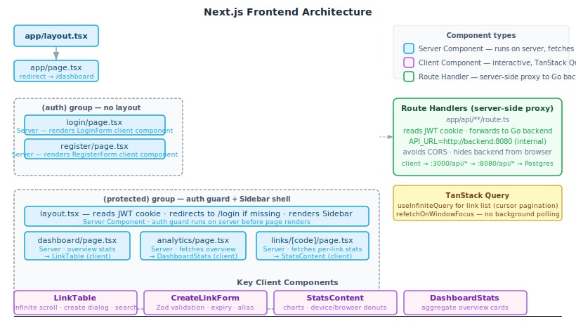

# Linkr — Frontend

Next.js dashboard for Linkr: create short links, manage them, and view per-link and aggregate analytics.
See the [root README](../README.md) for full-stack setup. See [DECISIONS.md](../DECISIONS.md) for trade-offs.

---

## Architecture



### Server vs Client components

**Server Components** (blue) run only on the server — they fetch data directly, produce no JS bundle, and handle auth guards.
**Client Components** (purple) are interactive — they own form state, charts, infinite scroll, and optimistic UI.
**Route Handlers** (green) are server-side proxies: browser calls hit `:3000/api/*`, which forwards to the Go backend at `http://backend:8080` (internal Docker network), reading the JWT cookie automatically. The browser never needs to know the backend address.

| What | Where | Why server/client |
|---|---|---|
| Auth guard | `(protected)/layout.tsx` | Server — reads cookie before any render, redirects instantly |
| Dashboard data | `dashboard/page.tsx` | Server — prefetches overview stats, no client waterfall |
| Link list | `LinkTable` | Client — infinite scroll, search, dialog, TanStack Query |
| Create link | `CreateLinkForm` | Client — Zod validation, controlled, no URL-state concerns |
| Analytics charts | `StatsContent` | Client — Recharts requires browser APIs |
| API calls | `app/api/**/route.ts` | Route Handler — proxy to Go backend, hides it from browser |

---

## Running

```bash
npm install          # first time only
npm run dev          # http://localhost:3000

# or via Task from repo root
task web
```

---

## Other commands

```bash
npm run build        # production build
npm run start        # serve the production build
npm run lint         # ESLint
```

---

## Environment variables

Copy `.env.example` to `.env.local`:

```bash
cp .env.example .env.local
```

| Variable | Default | Description |
|---|---|---|
| `NEXT_PUBLIC_API_URL` | `http://localhost:8080` | Backend URL used client-side (baked into JS bundle at build time) |
| `API_URL` | `http://localhost:8080` | Backend URL used server-side in Route Handlers |
| `JWT_COOKIE_NAME` | `linkr_token` | HTTP-only cookie name |

In Docker, `API_URL=http://backend:8080` (internal network). `NEXT_PUBLIC_API_URL` stays as `localhost:8080` so short-link hrefs work in the browser.

---

## Page structure

```
app/
  layout.tsx                        Root layout (fonts, providers)
  page.tsx                          Redirects to /dashboard or /login
  (auth)/
    login/page.tsx                  Login form (server shell + client form)
    register/page.tsx               Register form
  (protected)/
    layout.tsx                      Auth guard (server) + Sidebar shell
    dashboard/page.tsx              Link list + overview stats prefetch
    analytics/page.tsx              Aggregate stats across all links
    links/[code]/page.tsx           Per-link stats (charts, breakdowns)
  api/                              Route Handlers (server-side proxy to Go)
```

| Page | Screenshot |
|---|---|
| Login |  |
| Register |  |
| Analytics overview |   |
| Per-link stats |   |

---

## Key components

| Component | Type | Purpose |
|---|---|---|
| `Sidebar` | Client | Bitly-style left nav, route links, logout |
| `LinkTable` | Client | Infinite-scroll link list, create dialog, search, copy, toggle, delete |
| `CreateLinkForm` | Client | Controlled form — Zod validation, expiry picker, custom alias |
| `StatsContent` | Client | Per-link analytics: daily area chart, cumulative growth, day-of-week bar, device/browser donuts, referrer list |
| `DashboardStats` | Client | Aggregate overview cards and charts (analytics page) |
| `ClicksChart` | Client | Reusable Recharts area chart for daily click data |
| `DonutChart` | Client | Reusable Recharts pie chart for categorical breakdowns |
| `ConfirmModal` | Client | Reusable confirm dialog for toggle-active and delete actions |

### Data fetching

- **TanStack Query** for all client-side data: `useInfiniteQuery` for the link list (cursor-based pagination), `useQuery` for stats.
- `refetchOnWindowFocus: true` gives fresh data on tab return — no background polling (polling an infinite-scroll list scales poorly and gives wrong aggregate counts when not all pages are loaded).
- Server Components prefetch initial data via Route Handlers before the page hydrates, eliminating loading spinners on first paint.
